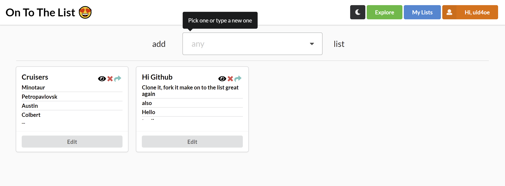

# To The List

Ye Ye Ye More Lists! To The List allows you to make any type of lists. Browse, edit, share, add to your library etc. Used React.js with Semantic UI, and Firebase for BaaS.

## Features

- Fire*based* crud app which emphasises on any type of list making, browsing, sharing etc.
  - Authentication with user profile support
  - CRUD operations for lists with drag & drop support
  - Dark/Light theme
  - Hooks with Context

## Planned Features

- Customize CRUD based on **list type**
  - Travel Lists: Pick places with **Google Maps integration**
  - Watch/Read/Listen Lists: Embed media, add link previews etc.
- Dynamic data enrichment and suggestions
- Offer more user interactions
  - Expand options in the settings
  - Add messaging or chatting

